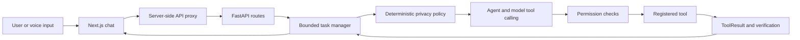

# JARVIS

JARVIS is a local Windows personal assistant with a FastAPI backend and a Next.js interface. The model interprets requests and selects registered tools; deterministic code applies privacy and permission rules, executes tools, records results, and decides task status.

## Start the app

1. Install Python 3.12, [uv](https://docs.astral.sh/uv/), and Node.js 20 or newer.
2. In `backend`, create a virtual environment and install Python dependencies:

   ```powershell
   py -3.12 -m venv .venv
   .\.venv\Scripts\python.exe -m pip install -r requirements.txt
   Copy-Item .env.example .env
   ```

3. Set a random `API_SECRET` in `backend/.env`. Set the same value as `JARVIS_API_SECRET` in `frontend/.env.local`. Provider keys are optional, but at least one configured provider must be reachable for language-model features. Do not commit either environment file.
4. In `frontend`, install dependencies and copy the proxy settings:

   ```powershell
   npm install
   Copy-Item .env.example .env.local
   ```

   Then set `JARVIS_API_SECRET` in `.env.local` to the same value as `backend/.env`.
5. Start the backend from the repository root with `uv run jarvish`. uv creates its project environment and installs the backend dependencies on the first run. Alternatively, use `python run.py` or, from `backend`, `\.venv\Scripts\python.exe -m uvicorn app.main:app --reload`.
6. In another terminal, start the UI from `frontend` with `npm run dev`, then open `http://localhost:3000`.

The frontend calls a same-origin Next.js route proxy. That proxy adds the backend secret on the server; the browser bundle does not contain it. Keep the backend bound to localhost unless you configure authentication and network access for your deployment.

## How a request flows



Model tool calling handles natural-language intent and tool selection. The retired regex fast router cannot execute requests. Language coverage depends on the configured model and its tool-calling support. If no tool call confirms a requested action, JARVIS returns a blocked status instead of claiming it ran.

`ToolResult.status` reports whether execution succeeded, failed, needs confirmation, or needs clarification. `verification_status` says whether the effect was observed. Background task status is based on tool attempts and verification, not the model's wording. Ordinary conversational turns can finish without a tool.

Privacy routing is deterministic and does not ask an LLM whether content is safe to send to a cloud provider. Explicit private requests always stay local. The current fixed rules also keep common sensitive terms, email addresses, credential-shaped values, and payment-card-shaped values local; this is a conservative safeguard, not a complete multilingual privacy classifier. Add or review policy rules in `backend/app/agent/privacy.py`.

## Developer checks

Run the backend suite from the repository root:

```powershell
.\backend\.venv\Scripts\python.exe -m pytest backend/tests -q
```

Build the frontend from the repository root:

```powershell
npm run build
```

See [the architecture guide](docs/architecture.md) for module boundaries and [the folder index](docs/folder-map.md) for per-folder file descriptions and connections.

## Project layout

- `backend/app/agent/` — request context, model tool loop, semantic fallback check, privacy policy, and prompts.
- `backend/app/permissions/` — deterministic allow, confirm, and block decisions.
- `backend/app/tools/` — registered desktop, browser, filesystem, memory, media, messaging, and information tools.
- `backend/app/tasks.py` — bounded task queue, cancellation, persistence, and status calculation.
- `backend/app/llm/` — provider chain and normalized model interface.
- `backend/app/api/` — HTTP endpoints and backend-secret validation.
- `backend/app/memory/` — SQLite chat, task, tool, and runtime-context persistence.
- `backend/tests/` — backend unit and architecture tests; network and device actions are mocked.
- `frontend/app/` — Next.js routes, layout, and page styles.
- `frontend/components/` — chat, status/activity panels, and avatar.
- `frontend/lib/` — typed API and activity clients.
- `docs/` — architecture and folder guides.

Generated local state lives under `data/`, which is ignored by Git. Local credentials belong in ignored `.env` files, never in source or documentation.
